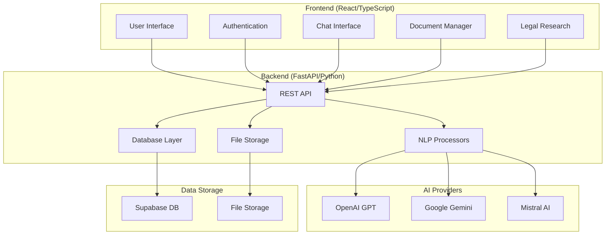

# 🏛️ Private Lawyer Bot

<div align="center">


[](https://python.org)
[](https://fastapi.tiangolo.com)
[](https://reactjs.org)
[](https://typescriptlang.org)
[](LICENSE)

**An intelligent AI-powered legal assistant that provides document analysis, legal research, and interactive chat support.**

[🚀 Quick Start](#-quick-start) • [📖 Documentation](#-documentation) • [🎯 Features](#-features) • [🛠️ Installation](#️-installation) • [🤝 Contributing](#-contributing)

</div>

---

## 📋 Table of Contents

- [🎯 Features](#-features)
- [🏗️ Architecture](#️-architecture)
- [🚀 Quick Start](#-quick-start)
- [🛠️ Installation](#️-installation)
- [⚙️ Configuration](#️-configuration)
- [🧠 AI Integration](#-ai-integration)
- [📚 API Documentation](#-api-documentation)
- [🔧 Development](#-development)
- [🚀 Deployment](#-deployment)
- [🤝 Contributing](#-contributing)
- [📄 License](#-license)

---

## 🎯 Features

### 🤖 **AI-Powered Legal Assistant**
- **Multi-Provider LLM Support**: OpenAI GPT, Google Gemini, Mistral AI
- **Intelligent Chat Interface**: Context-aware legal conversations
- **Smart Provider Selection**: Automatic fallback and load balancing

### 📄 **Document Analysis**
- **PDF Processing**: Extract and analyze legal documents
- **Entity Recognition**: Identify people, organizations, dates, and legal terms
- **Document Summarization**: AI-generated summaries and key points
- **Recommendation Engine**: Actionable insights from document analysis

### 🔍 **Legal Research**
- **Case Law Search**: Find relevant legal precedents
- **Jurisdiction-Specific Results**: Tailored to specific legal systems
- **Citation Analysis**: Proper legal citation formatting
- **Research Recommendations**: Suggested follow-up research

### 🔐 **Security & Authentication**
- **JWT-Based Authentication**: Secure user sessions
- **Role-Based Access Control**: Different permission levels
- **API Key Management**: Secure storage of LLM provider keys
- **Data Privacy**: Local storage with optional cloud backup

### 🎨 **Modern User Interface**
- **Responsive Design**: Works on desktop, tablet, and mobile
- **Dark/Light Mode**: User preference-based theming
- **Real-time Chat**: WebSocket-powered instant messaging
- **File Upload**: Drag-and-drop document upload interface

---

## 🏗️ Architecture

<div align="center">



</div>

### 🔧 **Technology Stack**

| Layer | Technologies |
|-------|-------------|
| **Frontend** | React 18, TypeScript, Tailwind CSS, Axios |
| **Backend** | FastAPI, Python 3.11+, Pydantic, Uvicorn |
| **AI/ML** | OpenAI API, Google Gemini, Mistral AI, spaCy, LangChain |
| **Database** | Supabase (PostgreSQL), Mock DB for development |
| **Authentication** | JWT, bcrypt, python-jose |
| **File Processing** | PyPDF2, python-docx, openpyxl |
| **Deployment** | Docker, Vercel, Railway, Heroku |

---

## 🚀 Quick Start

### Prerequisites
- **Python 3.11+** 
- **Node.js 18+** 
- **npm or yarn**

### 1️⃣ Clone the Repository
```bash
git clone https://github.com/yourusername/private-lawyer-bot.git
cd private-lawyer-bot
```

### 2️⃣ Backend Setup
```bash
cd backend
python -m venv venv
venv\Scripts\activate  # Windows
# source venv/bin/activate  # macOS/Linux

pip install -r requirements.txt
python fixed_server.py
```

### 3️⃣ Frontend Setup
```bash
cd frontend
npm install
npm start
```

### 4️⃣ Access the Application
- **Frontend**: http://localhost:3000
- **Backend API**: http://localhost:9002
- **API Documentation**: http://localhost:9002/docs

---

## 🛠️ Installation

### 🐍 **Backend Installation**

#### Basic Installation
```bash
cd backend
python -m venv venv
venv\Scripts\activate
pip install -r requirements.txt
```

#### Enhanced NLP Features (Optional)
```bash
# Install advanced NLP dependencies
pip install -r nlp_requirements.txt

# Download spaCy model
python -m spacy download en_core_web_sm

# Or use the automated installer
../install-nlp-deps.bat
```

### ⚛️ **Frontend Installation**
```bash
cd frontend
npm install

# For development
npm start

# For production build
npm run build
```

### 🐳 **Docker Installation** (Coming Soon)
```bash
# Build and run with Docker Compose
docker-compose up --build
```

---

## ⚙️ Configuration

### 🔑 **Environment Variables**

#### Backend Configuration (`backend/.env`)
```env
# Application Settings
DEBUG=true
SECRET_KEY=your-secret-key-here

# Database Configuration
SUPABASE_URL=https://your-project.supabase.co
SUPABASE_KEY=your-supabase-anon-key
SUPABASE_MOCK=true  # Set to false for production

# AI Provider API Keys
OPENAI_API_KEY=sk-your-openai-key
GEMINI_API_KEY=your-gemini-key
MISTRAL_API_KEY=your-mistral-key

# NLP Configuration
SPACY_MODEL=en_core_web_sm
DEFAULT_LLM_PROVIDER=openai
```

#### Frontend Configuration (`frontend/.env`)
```env
REACT_APP_API_URL=http://localhost:9002
REACT_APP_ENVIRONMENT=development
```

### 🎛️ **Application Settings**

The application supports runtime configuration through the Settings page:
- **API Keys**: Configure LLM provider keys without server restart
- **Provider Selection**: Choose preferred AI provider
- **Theme Settings**: Dark/light mode preferences
- **Language Settings**: Interface language selection

---

## 🧠 AI Integration

### 🤖 **Supported AI Providers**

| Provider | Models | Features |
|----------|--------|----------|
| **OpenAI** | GPT-3.5-turbo, GPT-4 | Chat, document analysis, summarization |
| **Google Gemini** | Gemini Pro, Gemini Pro Vision | Multimodal analysis, code generation |
| **Mistral AI** | Mistral 7B, Mixtral 8x7B | Fast inference, multilingual support |

### 🔄 **Provider Selection Logic**

1. **Manual Selection**: User chooses specific provider
2. **Auto-Selection**: System uses first available provider
3. **Fallback Chain**: OpenAI → Gemini → Mistral → Rule-based responses
4. **Load Balancing**: Distribute requests across available providers

### 📊 **AI Capabilities**

#### Document Analysis
- **Text Extraction**: PDF, DOCX, TXT files
- **Entity Recognition**: Legal entities, dates, monetary amounts
- **Summarization**: Key points and executive summaries
- **Recommendations**: Actionable insights and next steps

#### Legal Research
- **Case Law Search**: Relevant precedents and citations
- **Statute Analysis**: Legal code interpretation
- **Jurisdiction Mapping**: Location-specific legal information
- **Citation Generation**: Proper legal citation formats

#### Chat Interface
- **Context Awareness**: Maintains conversation history
- **Legal Expertise**: Specialized legal knowledge base
- **Multi-turn Conversations**: Complex legal discussions
- **Source Attribution**: References and disclaimers

---

## 📚 API Documentation

### 🔗 **Base URL**
```
http://localhost:9002/api
```

### 🔐 **Authentication**
```bash
# Login
POST /auth/login
Content-Type: application/json

{
  "email": "user@example.com",
  "password": "password"
}

# Response
{
  "access_token": "eyJ0eXAiOiJKV1QiLCJhbGciOiJIUzI1NiJ9...",
  "token_type": "bearer"
}
```

### 💬 **Chat Endpoints**
```bash
# Send message
POST /chat/send
Authorization: Bearer <token>
Content-Type: application/json

{
  "content": "What is contract law?",
  "provider": "openai"  # optional
}

# Get chat history
GET /chat/history?limit=50
Authorization: Bearer <token>
```

### 📄 **Document Endpoints**
```bash
# Upload document
POST /documents/upload
Authorization: Bearer <token>
Content-Type: multipart/form-data

title: "Contract Analysis"
description: "Employment contract review"
file: <binary-file-data>

# Analyze document
POST /documents/{document_id}/analyze
Authorization: Bearer <token>
```

### 🔍 **Legal Research Endpoints**
```bash
# Legal query
POST /legal/query
Authorization: Bearer <token>
Content-Type: application/json

{
  "question": "What are the requirements for a valid contract?",
  "jurisdiction": "US"
}

# Case law search
POST /legal/case-law
Authorization: Bearer <token>
Content-Type: application/json

{
  "keywords": ["contract", "breach"],
  "jurisdiction": "US",
  "year_range": [2020, 2024]
}
```

### 📖 **Interactive API Documentation**
Visit http://localhost:9002/docs for the complete interactive Swagger documentation.

---

## 🔧 Development

### 🏃‍♂️ **Running in Development Mode**

#### Backend Development
```bash
cd backend
venv\Scripts\activate
python fixed_server.py

# With auto-reload
uvicorn app.main:app --reload --host 0.0.0.0 --port 9002
```

#### Frontend Development
```bash
cd frontend
npm start

# With specific port
npm start -- --port 3001
```

### 🧪 **Testing**

#### Backend Tests
```bash
cd backend
pytest

# With coverage
pytest --cov=app tests/
```

#### Frontend Tests
```bash
cd frontend
npm test

# Run all tests
npm test -- --coverage --watchAll=false
```

### 🔍 **Code Quality**

#### Python Code Quality
```bash
# Linting
flake8 backend/app/

# Type checking
mypy backend/app/

# Formatting
black backend/app/
```

#### TypeScript Code Quality
```bash
# Linting
npm run lint

# Type checking
npm run type-check

# Formatting
npm run format
```

### 📁 **Project Structure**
```
private-lawyer-bot/
├── 📁 backend/                 # Python FastAPI backend
│   ├── 📄 fixed_server.py      # Main server file
│   ├── 📄 requirements.txt     # Python dependencies
│   ├── 📄 nlp_requirements.txt # Optional NLP dependencies
│   └── 📁 app/                 # Application code
│       ├── 📁 api/             # API endpoints
│       ├── 📁 core/            # Core functionality
│       ├── 📁 db/              # Database integration
│       └── 📁 nlp/             # AI/NLP processors
├── 📁 frontend/                # React TypeScript frontend
│   ├── 📄 package.json         # Node.js dependencies
│   ├── 📁 src/                 # Source code
│   │   ├── 📁 components/      # Reusable components
│   │   ├── 📁 pages/           # Application pages
│   │   ├── 📁 services/        # API services
│   │   └── 📁 types/           # TypeScript types
│   └── 📁 public/              # Static assets
├── 📄 README.md                # This file
├── 📄 SETUP-NLP-GUIDE.md      # NLP setup guide
└── 📄 install-nlp-deps.bat    # NLP installer script
```

---

## 🚀 Deployment

### 🌐 **Frontend Deployment**

#### Vercel (Recommended)
```bash
# Install Vercel CLI
npm i -g vercel

# Deploy
cd frontend
vercel --prod
```

#### Netlify
```bash
# Build for production
npm run build

# Deploy dist folder to Netlify
```

### 🖥️ **Backend Deployment**

#### Railway
```bash
# Install Railway CLI
npm install -g @railway/cli

# Login and deploy
railway login
railway deploy
```

#### Heroku
```bash
# Create Heroku app
heroku create your-app-name

# Deploy
git push heroku main
```

#### Docker
```dockerfile
# Dockerfile for backend
FROM python:3.11-slim

WORKDIR /app
COPY requirements.txt .
RUN pip install -r requirements.txt

COPY . .
EXPOSE 9002

CMD ["python", "fixed_server.py"]
```

### 🔧 **Environment Configuration**

#### Production Environment Variables
```env
# Backend (.env)
DEBUG=false
SECRET_KEY=your-production-secret-key
SUPABASE_MOCK=false
SUPABASE_URL=your-production-supabase-url
SUPABASE_KEY=your-production-supabase-key

# Frontend (.env.production)
REACT_APP_API_URL=https://your-backend-domain.com
REACT_APP_ENVIRONMENT=production
```

---

## 🤝 Contributing

We welcome contributions! Please see our [Contributing Guidelines](CONTRIBUTING.md) for details.

### 🐛 **Bug Reports**
- Use the [issue tracker](https://github.com/yourusername/private-lawyer-bot/issues)
- Include detailed reproduction steps
- Provide system information and logs

### 💡 **Feature Requests**
- Check existing [feature requests](https://github.com/yourusername/private-lawyer-bot/issues?q=is%3Aissue+is%3Aopen+label%3Aenhancement)
- Describe the use case and expected behavior
- Consider implementation complexity

### 🔧 **Development Workflow**
1. Fork the repository
2. Create a feature branch (`git checkout -b feature/amazing-feature`)
3. Make your changes
4. Add tests for new functionality
5. Ensure all tests pass
6. Commit your changes (`git commit -m 'Add amazing feature'`)
7. Push to the branch (`git push origin feature/amazing-feature`)
8. Open a Pull Request

---

## 📄 License

This project is licensed under the MIT License - see the [LICENSE](LICENSE) file for details.

---

## 🙏 Acknowledgments

- **FastAPI** - Modern, fast web framework for building APIs
- **React** - A JavaScript library for building user interfaces
- **OpenAI** - Advanced AI language models
- **Google AI** - Gemini AI models and services
- **Mistral AI** - Open-source language models
- **Supabase** - Open source Firebase alternative
- **spaCy** - Industrial-strength Natural Language Processing
- **LangChain** - Framework for developing applications with LLMs

---

## 📞 Support

- **Documentation**: [Setup Guide](SETUP-NLP-GUIDE.md)
- **Issues**: [GitHub Issues](https://github.com/yourusername/private-lawyer-bot/issues)
- **Discussions**: [GitHub Discussions](https://github.com/yourusername/private-lawyer-bot/discussions)
- **Email**: support@privatelawyer.bot

---

<div align="center">

**Made with ❤️ for the legal community**

[](https://github.com/yourusername/private-lawyer-bot/stargazers)
[](https://github.com/yourusername/private-lawyer-bot/network/members)
[](https://github.com/yourusername/private-lawyer-bot/issues)

</div>